<p align="center">
  
</p>

<p align="center">
  <a href="https://github.com/Wickedsoni/pebble/releases"></a>
  <a href="https://github.com/Wickedsoni/pebble/actions/workflows/ci.yml"></a>
  
  
  <a href="LICENSE"></a>
</p>

<p align="center">
  <a href="#-install">Install</a> ·
  <a href="#-whats-new">What's new</a> ·
  <a href="#-what-pebble-does">Features</a> ·
  <a href="#-how-it-works">How it works</a> ·
  <a href="#-problems-we-found-and-how-we-fixed-them">Problems we fixed</a> ·
  <a href="#-whats-next">What's next</a> ·
  <a href="#-build-from-source">Build</a>
</p>

Pebble is a small pet that lives on your taskbar. It reminds you to drink water, stretch and rest your eyes. It keeps your notes, reminders and calendar. You can type to it or talk to it as you talk to a friend:

> *"kal shaam saade paanch baje mummy ko call karna yaad dila dena"* · *"शुक्रवार को चार बजे मीटिंग है"* · *"remind me abt the viva tmrw 10am"*

Its brain is a set of small models on your laptop. They learn from how you use Pebble. **No cloud. No account. No telemetry.**

<p align="center"></p>

<p align="center"></p>

> **Status:** early and in active development. Windows 10/11 only. Contributions are welcome. See [CONTRIBUTING.md](CONTRIBUTING.md).

---

## ✨ What's new

Everything below came after the first public release (v0.1.2). It ships in **v0.3.0**.

<table>
<tr>
<td width="50%" valign="top">

### 🧠 A smarter brain
- **Search by meaning.** Ask for a note, a fact or something you said, in your own words. The command model now also gives a sentence embedding (WP C1, C2).
- **It learns you at once.** When you teach Pebble a command or pick from "Did you mean…?", the next similar sentence goes the right way. No retrain needed (WP C3, ADR 0010).
- **Local chat (optional, off by default).** Smart small-talk replies from a small model (Qwen2.5-1.5B) that runs on `127.0.0.1` only. English only for now (WP C5, ADR 0012).
- **Signed model packs.** Pebble loads a model from your user folder only if its Ed25519 signature and every file hash are correct (WP D2, ADR 0011).
- **Lite installer.** A smaller installer without the speech models. Add voice later as a signed pack.

</td>
<td width="50%" valign="top">

### 🗂️ Your data, safer
- **Calendar.** Events, repeats (daily, weekly, monthly, yearly), ICS import and export, an agenda on the Today page and reminders before events (WP E2, ADR 0014).
- **Encrypted backup.** One file, AES-256-GCM, with a key from your passphrase. Restore on a new PC (WP E4, ADR 0015).
- **History and restore.** Old versions of notes, reminders and events stay 90 days on this PC. Restore a version, or bring back a deleted item (WP E3c, ADR 0019).
- **Edit a note** from the Notes page. The old text stays in its History until you delete it.
- **Ready for sync.** Every change goes into a change journal with a hybrid logical clock. A tested merge makes three devices agree (WP E3a/E3b, ADR 0018). Nothing leaves your PC yet.

</td>
</tr>
<tr>
<td valign="top">

### ⚡ Faster and steadier
- Events are written off the UI thread, in batches (WP B5).
- All-time stats on 200 000 events: **158 ms → 31 ms** (WP B6).
- Model check at start: **~180 ms → ~1 ms** with a cache of verified hashes (WP B4).
- One app scope stops every background job on exit (WP B1).

</td>
<td valign="top">

### 🛡️ Quality gates
- Model tests run in CI on every PR, with frozen eval sets.
- A 3-device **convergence test** for the sync engine (300 random sequences).
- An **offline gate** for reminder-timing changes (IPS, ADR 0016).
- A **red/blue QA round**: one team attacked, the other fixed. See below.

</td>
</tr>
</table>

---

## 📦 Install

**Requirements:** Windows 10 or 11 (64-bit), about 1 GB of disk space, 8 GB RAM recommended, and a microphone if you want to talk to Pebble.

1. **Download** `Pebble-<version>.msi` from the [Releases page](https://github.com/Wickedsoni/pebble/releases) (the newest is at the top). The models are inside, so you do not need other downloads. `Pebble-lite-<version>.msi` is smaller and has no voice. You can add voice later as a signed model pack (About → Model packs).
2. **Optional: check the download.** In PowerShell, run `Get-FileHash .\Pebble-<version>.msi` and compare the hash with `SHA256SUMS` on the release page.
3. **Run the installer.** It installs only for you, so you do not need admin rights. Windows can show **"Windows protected your PC"**, because the installer is not code-signed yet (signing certificates cost money, and this is a free project). Click **More info → Run anyway**.
4. **Start Pebble** from the Start menu. The pet appears on your taskbar.
   - Press **Ctrl+Alt+Space** to type to it.
   - **Hold** Ctrl+Alt+Space to talk.
   - Right-click the pet, or use the tray icon, to open the Pebble window (settings, notes, calendar, Memory).
5. **Uninstall** from *Settings → Apps → Installed apps → Pebble*. Your data stays in `%APPDATA%\Pebble`. Delete that folder to remove it too.

If something breaks, or Pebble does not understand you, please [open an issue](https://github.com/Wickedsoni/pebble/issues/new/choose).

---

## 🐾 What Pebble does

| | |
|---|---|
| **Desktop pet** | Five characters with growth stages and moods. It walks on the taskbar, follows your cursor, sleeps when you are away and hides for fullscreen apps. It saves battery: about 4 Hz when still, and no walks in battery saver. |
| **Glass app** | Today, Water, Notes, Reminders, Calendar, Companion and Memory pages over animated aurora backgrounds. |
| **Reminders that learn** | Water, stretch and 20-20-20 eye breaks, each *gentle*, *normal* or *strict*. A small learning policy finds *when* a reminder helps you, and waits at the times you always skip. |
| **Quick Add** (`Ctrl+Alt+Space`) | Type, or **hold to talk**, in English, Devanagari or Roman Hindi, mixed freely. When Pebble is not sure, it asks "Did you mean…?". "Not what I meant" undoes a guess, and your answer teaches Pebble. |
| **Calendar** | Events and repeats, ICS import and export from Google or Outlook, and reminders before events. Quick Add: `event: dentist friday 5pm for 30 min`. |
| **Memory** | Your habits, streaks and mood trends. Search by meaning. You can read every item on the Memory page and delete it with one click. |
| **History** | Old versions of each note, reminder and event, and "Recently deleted". Restore or delete them. |
| **Backup** | About → Backup: an encrypted file that you can keep on a USB stick or in a cloud folder. |

---

## 🔬 How it works

<p align="center"></p>

- **Command model:** a `multilingual-e5-small` encoder, fine-tuned with intent, slot and mood heads. Training data: Amazon MASSIVE and Pebble's own data. The vocabulary is pruned from 250k to 27k pieces and the model is int8: **31 MB, about 5 ms per command on a CPU**. Its confidence is calibrated: "80% sure" means right about 80% of the time.
- **Personal layer:** your taught and picked sentences vote for their action when a new sentence is close in meaning *and* in words.
- **Speech:** [sherpa-onnx](https://github.com/k2-fsa/sherpa-onnx) with Silero VAD and Whisper, all offline. The microphone is open only while you hold the key.
- **Habit policy:** a contextual Thompson-sampling bandit. It gets a reward when you do a reminder.
- **Data:** SQLite (WAL) through SQLDelight. Every transaction begins `IMMEDIATE`. Synced tables write a change journal with a hybrid logical clock.
- **Low power:** models load when you need them and unload after 10 idle minutes.

The full design, with file pointers, the training loop and the quality gates, is in [docs/ARCHITECTURE.md](docs/ARCHITECTURE.md). Each design decision has an ADR in [docs/adr/](docs/adr/).

---

## 🩺 Problems we found and how we fixed them

We record each real problem, its cause and its fix. Each fix has a test that fails on the old code.

| Problem | Cause | Fix |
|---|---|---|
| **Devanagari letters vanished** from voice text (`पर्यावरण` → `र्यारन`). Whisper looked like 89% word errors on Hindi. | One Devanagari letter is 3 bytes and can span two Whisper tokens. The decoder read each token alone. | The model ships a token table in hex. Pebble joins the bytes, then decodes UTF-8 one time. |
| **"Database is busy"** errors in the history roll-up and in reminders. | SQLDelight begins transactions *deferred*. In WAL mode, a read-then-write transaction fails at once when another writer commits first. `busy_timeout` does not help. | A local copy of the SQLite driver that begins every transaction `IMMEDIATE` (ADR 0017). A guard test fails when SQLDelight changes. |
| **The same model gave different answers** on the CI machine (3 of 194 commands). | x86 CPUs without VNNI saturate full 8-bit weights. | Quantize with `reduce_range=True`. The CI log shows which CPU ran the tests. |
| **A failed restore could empty your data.** If antivirus locked a file half-way, Pebble made a new empty database. | The swap was not atomic, and nothing undid it. | Renames only, every step undone in reverse on failure, crash repair at next start, and a clear dialog instead of an empty database. |
| **Events were lost silently** after one failed disk write. | One error ended the event writer for good. | Retry, then write row by row. Report to `pebble.log`. `flush()` always ends. |
| **The app froze at start** with some calendar repeats. | A monthly rule on a day that never comes (for example the 30th, every 12 months from February) looped for ever on the UI thread. | The generator stops after 500 empty periods. A review proved that this limit is safe. |
| **Events showed on two days** when imported in another time zone. | The day came from the event zone, not your zone. | Each timed occurrence uses the day in your zone. |
| **Smart replies froze the window** for 1–6 s, and a quit during start-up left a 1.7 GB server running. | A blocking HTTP call on the UI thread; the starting process was not tracked. | Async calls on the IO thread with a deadline. `close()` stops a server that is still starting. |
| **Another app could take the chat port** and read the chat text. | The port was free for a short time before the chat server opened it. | Pebble checks that its own child process is the only listener before it sends the key. Else: a new port. |
| **No reminder appeared** when "Show Pebble on the desktop" was off. | Only the pet window showed reminders. | A separate reminder presenter. With the pet hidden, a due reminder becomes a Windows notification. |
| **A second launch did nothing** while Pebble ran in the background. | The single-instance check only exited. | The second launch signals the first one (a named Windows event, no socket), and the window opens. |
| **About 7 GB of folders piled up in `%TEMP%`.** | ONNX Runtime and sherpa-onnx unpacked their DLLs into a new temp folder at each start, and Windows cannot delete loaded DLLs. | The DLLs ship inside the app. At start, Pebble safely removes old folders. The app folder also went from 509 MB to 462 MB. |
| **An old voice clip ran hours later** at the next Quick Add. | A transcription from a closed session could still finish. | Each voice session has a number; a clip from an old session is dropped. |
| **A reminder for a deleted or moved event.** | The 10-minute agenda loop read the event, then the event changed. | The loop writes only if the event still has the same clock value, in one `IMMEDIATE` transaction. |

> **How we find them.** We use a *red/blue QA game*. A red team attacks the code and writes findings. A lead checks each finding. A blue team fixes them, and a second review must approve each fix. Round 1 is merged (PRs #57–#69).

---

## 🗺️ What's next

<p align="center"></p>

| When | What |
|---|---|
| **Next** | **Desktop quality (G–K):** every control works with the keyboard, hover and focus states, tooltips, right-click menus, a resizable window, screen-reader support, UI tests, faster queries and a log that keeps private text out. |
| **Next** | **Wardrobe and your own avatar:** layered pets, a size slider (60–160%), caps and glasses, and safe SVG import. |
| **Later** | **Family circle:** pair your own devices with a code. Sync the calendar and shared reminders peer to peer, end-to-end encrypted, off by default. Pebble runs no servers (ADR 0005, 0006). |
| **Later** | **Home hub:** a family PC lends a larger chat model and speech model to weak laptops. The command model stays on each device. |
| **Later** | **Better Hindi:** Hindi and Hinglish chat, and a Whisper fine-tune on Hinglish from opt-in correction clips. |

The full list is in [docs/ROADMAP.md](docs/ROADMAP.md).

---

## 🛠️ Build from source

**Requirements:** Windows 10/11 and JDK 21. For training: Python 3.11 through [uv](https://docs.astral.sh/uv/), and optionally an NVIDIA GPU.

```powershell
git clone https://github.com/Wickedsoni/pebble.git
cd pebble
python brain/src/pebble_brain/download_models.py   # get and check every model file
./gradlew :desktopApp:run                          # start Pebble
./gradlew spotlessCheck :shared:jvmTest :desktopApp:test --console=plain   # format check + all tests
./gradlew :desktopApp:packageMsi                   # installer (-Pflavor=lite: no speech models)
```

**The models are not in git** (they are tens to hundreds of MB). They are release downloads, listed with their checksums in `brain/models/manifest.json`. The downloader needs Python 3.10+ and no extra packages. Without models, Pebble still works on rules: exact phrases, times and notes.

To train the models yourself:

```powershell
cd brain
python -m uv sync
python -m uv run python data/download_massive.py
python -m uv run python -m pebble_brain.train_intent --out models/intent-v3
python -m uv run python -m pebble_brain.prune_vocab models/intent-v3 models/intent-v3-pruned
python -m uv run python -m pebble_brain.export_onnx models/intent-v3-pruned
```

See [brain/README.md](brain/README.md) for the speech models and the training details.

## 📁 Repository layout

| Path | What |
|---|---|
| `shared/` | Kotlin Multiplatform core: rules, router, decision policy, reminders, calendar, memory search, sync journal, backup, SQLite (SQLDelight) |
| `desktopApp/` | Compose Desktop app: pet, pages, Quick Add, ONNX and speech runtimes, local chat, packaging |
| `brain/` | Python: datasets, training, evaluation, ONNX export, calibration (never shipped to users) |
| `brain/eval/` | Frozen test sets. **Never train on these.** |
| `docs/` | Architecture, roadmap, ADRs (`adr/`), specs (`specs/`), release notes (`releases/`) |
| `tools/` | UI smoke test and performance scripts |

## 🔒 Privacy

Pebble runs offline. Your notes, reminders, calendar, habits and corrections stay in `%APPDATA%\Pebble` on your computer. The microphone is open only while you hold the talk key. Voice clips are kept only if you turn that on *and* correct a transcript, and you can delete them on the Memory page. The optional chat model listens only on `127.0.0.1`. Details: [PRIVACY.md](PRIVACY.md).

## 🤝 Contributing

There is useful work at every level: Hinglish phrases and test sentences, Kotlin UI, reminder logic, model training, and speech accuracy for Indian accents. Start with [CONTRIBUTING.md](CONTRIBUTING.md) and look for issues with the label `good first issue`. Please follow the [Code of Conduct](CODE_OF_CONDUCT.md). Report security problems privately, as [SECURITY.md](SECURITY.md) tells you.

## 📄 License

Pebble's code has the [Apache License 2.0](LICENSE). It uses open datasets and models (Amazon MASSIVE, Google FLEURS, multilingual-e5, Whisper, Silero VAD, sherpa-onnx). Their licenses and the necessary attributions are in [NOTICE](NOTICE). The optional chat pack carries its own licenses (Qwen2.5, llama.cpp).

<p align="center"><sub>Made with care for people who think in more than one language.</sub></p>
