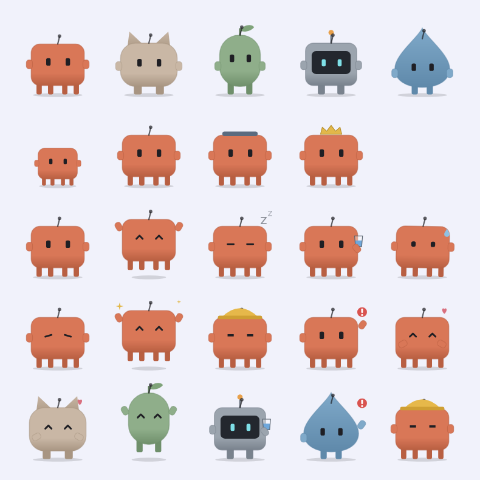

# Pebble

**A desktop companion for Windows that understands English, Hindi and Hinglish, and runs its AI entirely on your laptop.**

Pebble is a small pet that lives on your taskbar. It nudges you to drink water, stretch and rest your eyes, and keeps your notes and reminders. You can type to it or talk to it the way you'd talk to a friend: *"kal shaam saade paanch baje mummy ko call karna yaad dila dena"*, *"शुक्रवार को चार बजे मीटिंग है"*, *"remind me abt the viva tmrw 10am"*. Its brain is a set of small local models that learn from how you use it. No cloud, no account, no telemetry.

<p align="center"></p>

> **Status:** early and actively developed (v0.1). Windows 10/11 only for now. Contributions welcome. See [CONTRIBUTING.md](CONTRIBUTING.md).

## Install

**Requirements:** Windows 10 or 11 (64-bit), about 1 GB of disk space, 8 GB RAM recommended, and a microphone if you want to talk to it.

1. **Download** `Pebble-<version>.msi` from the [Releases page](https://github.com/Wickedsoni/pebble/releases) (the newest one at the top). The models are inside, so there's nothing else to download. From the next release there is also `Pebble-lite-<version>.msi`: it is smaller and has no voice. You can add voice later as a signed model pack (About → Model packs).
2. **Optional: check the download.** In PowerShell, run `Get-FileHash .\Pebble-<version>.msi` and compare the hash with `SHA256SUMS` on the release page.
3. **Run the installer.** It installs just for you, so no admin rights are needed. Windows may show **"Windows protected your PC"**. That's because the installer isn't code-signed yet (signing certificates are paid, and this is a free project). Click **More info → Run anyway**.
4. **Start Pebble** from the Start menu. The pet appears on your taskbar.
   - Press **Ctrl+Alt+Space** to type to it.
   - **Hold** Ctrl+Alt+Space to talk.
   - Settings, notes and the Memory page live in the Pebble window (right-click the pet, or use the tray icon).
5. **Uninstall** from *Settings → Apps → Installed apps → Pebble*. Your data stays in `%APPDATA%\Pebble`; delete that folder to remove it too.

Pebble is an early pre-release. If something breaks or Pebble misunderstands you, please [open an issue](https://github.com/Wickedsoni/pebble/issues/new/choose).

## What it does

- **Desktop pet:** five characters with growth stages and moods. It walks along the taskbar, follows your cursor, naps when you're away, and hides for fullscreen apps. It's battery-aware: about 4 Hz when still, and no wandering in battery saver.
- **Glass app:** Today, Water, Notes, Reminders, Companion and Memory pages over animated aurora backgrounds.
- **Reminders that learn:**
  - Water, stretch and 20-20-20 eye breaks, each *gentle*, *normal* or *strict*.
  - A small reinforcement-learning policy learns *when* nudges actually land for you, and waits out the moments you always skip.
- **Quick Add** (`Ctrl+Alt+Space`):
  - Type or **hold to talk**, in English, Devanagari or Roman Hindi, mixed freely.
  - When it isn't sure, it asks "Did you mean…?".
  - "Not what I meant" undoes any guess, and your answer teaches the next model.
- **Memory:** learns your habits, streaks and mood trends. Everything is readable on the Memory page and deletable with one click.

## How it works

```
voice (hold Ctrl+Alt+Space) → mic → filter → Silero VAD → Whisper ─┐
typed text ─────────────────────────────────────────────────────────┤
                                                                    ▼
rules (exact syntax, Hinglish times/dates) → e5 encoder → intent · slots · mood heads
→ calibrated decision (act / ask) → action + reply in your script
→ what you do next becomes training data (gated retrain, never silent)
```

- **Command model:**
  - A `multilingual-e5-small` encoder fine-tuned with intent, slot and mood heads, trained on Amazon MASSIVE plus Pebble's own data.
  - Its vocabulary is pruned from 250k to 27k pieces, and it's quantised to int8: **31 MB, about 5 ms per command on CPU**.
  - Its confidence is calibrated, so "80% sure" means right about 80% of the time.
- **Speech:** [sherpa-onnx](https://github.com/k2-fsa/sherpa-onnx) with Silero VAD and Whisper, all offline. The mic is open only while you hold the key.
- **Habit policy:** a contextual Thompson-sampling bandit. It's rewarded when a reminder gets done.
- **Low power:** models load on demand and free themselves after 10 idle minutes.

The full design, with file pointers, the training loop and the quality gates, is in [docs/ARCHITECTURE.md](docs/ARCHITECTURE.md). Where it's going is in [docs/ROADMAP.md](docs/ROADMAP.md).

## Build from source

**Requirements:** Windows 10/11, JDK 21. For training: Python 3.11 via [uv](https://docs.astral.sh/uv/), and optionally an NVIDIA GPU.

```powershell
git clone https://github.com/Wickedsoni/pebble.git
cd pebble
./gradlew :desktopApp:run                  # start Pebble
./gradlew :shared:jvmTest :desktopApp:test # run the tests
./gradlew :desktopApp:packageMsi           # build an installer (-Pflavor=lite: without the speech models)
```

**Models aren't stored in git** (they're tens to hundreds of MB). They're published as release downloads, listed with their checksums in `brain/models/manifest.json`. Fetch them before running (Python 3.10+, no extra packages):

```powershell
python brain/src/pebble_brain/download_models.py   # downloads + verifies every model file
```

Without models, Pebble still works on rules: exact phrasings, times and notes. To train the models yourself instead:

```powershell
cd brain
python -m uv sync
python -m uv run python data/download_massive.py
python -m uv run python -m pebble_brain.train_intent --out models/intent-v2
python -m uv run python -m pebble_brain.prune_vocab models/intent-v2 models/intent-v2-pruned
python -m uv run python -m pebble_brain.export_onnx models/intent-v2-pruned
```

See [brain/README.md](brain/README.md) for the speech models and the training details. Prebuilt models are in the [models-2026.10](https://github.com/Wickedsoni/pebble/releases/tag/models-2026.10) release. Get them with `python brain/src/pebble_brain/download_models.py`.

## Repository layout

| Path | What |
|---|---|
| `shared/` | Kotlin Multiplatform core: rules, decision policy, reminders, memory, nudge bandit, SQLite (SQLDelight) |
| `desktopApp/` | Compose Desktop app: pet, windows, Quick Add, ONNX and speech runtimes, packaging |
| `brain/` | Python: datasets, training, evaluation, ONNX export, calibration (never shipped to users) |
| `brain/eval/` | Frozen test sets. **Never train on these.** |
| `docs/` | Architecture, roadmap |

## Privacy

Pebble runs offline. Your notes, reminders, habits and corrections live in `%APPDATA%\Pebble` and never leave your computer. The microphone is open only while you hold the talk key. Voice clips are kept only if you switch that on *and* correct a transcript, and they can be deleted from the Memory page.

## Contributing

There's useful work at every level: Hinglish phrasings and test sentences, Kotlin UI, reminder logic, model training, speech accuracy for Indian accents. Start with [CONTRIBUTING.md](CONTRIBUTING.md) and look for issues labelled `good first issue`. Please follow the [Code of Conduct](CODE_OF_CONDUCT.md), and report security issues privately as described in [SECURITY.md](SECURITY.md).

## License

Pebble's code is licensed under the [Apache License 2.0](LICENSE). It builds on open datasets and models (Amazon MASSIVE, Google FLEURS, multilingual-e5, Whisper, Silero VAD, sherpa-onnx). Their licenses and the required attributions are listed in [NOTICE](NOTICE).
